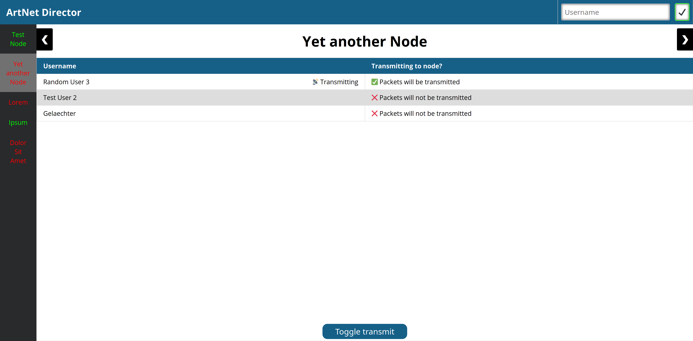

<!-- PROJEKTLOGO -->
<p align="center">
  <a href="README.md">🇬🇧 English</a>
  &nbsp;
  <a href="README.de.md">🇩🇪 Deutsch</a>
  </br></br>
  <a href="https://github.com/gelaechter/ArtNetDirector">
    
  </a>

<h1 align="center">ArtNet Director</h1>

  <p align="center">
    Eine Client-Server basierte Anwendung zur selektiven Verteilung von Art-Net Paketen.
    <br />
    <a href="https://github.com/gelaechter/ArtNetDirector/wiki"><strong>Lies die Dokumentation »</strong></a>
    <br />
    <br />
    <a href="https://github.com/gelaechter/ArtNetDirector/issues">Bug melden</a>
    ·
    <a href="https://github.com/gelaechter/ArtNetDirector/issues">Feature anfordern</a>
    ·
    <a href="https://github.com/gelaechter/ArtNetDirector/issues">Frage stellen</a>

  </p>
</p>



## Über das Projekt
ArtNet Director ist eine Client-Server basierte Anwendung, zur selektiven Verteilung von Art-Net Paketen.
Ihr Hauptzweck ist es, den Wechsel zwischen mehreren Benutzern bei begrenzter Anzahl von Art-Net Knoten zu erleichtern.
Die Bedienung erfolgt über ein Webinterface, d.h. es läuft als Server auf einem Rechner, auf welchen dann von anderen Rechnern im lokalen Netzwerk mit einem Webbrowser zugegriffen werden kann.

## Installation

Du musst [Java](https://java.com/en/download/) auf deinem Rechner installiert haben, um diese Anwendung auszuführen.

* Lade die neueste jar-Datei von den Releases herunter.
* Verschiebe die jar-Datei in ein neues Verzeichnis
* Starte die jar-Datei, z.B. durch einen Doppelklick oder von der Kommandozeile aus:
``` sh
java -jar ArtNetDirector.jar
```

In der Konsole der Anwendung findest du was du im Webbrowser öffnen musst.

### Erstellen vom Quellcode
Dieses Projekt wurde mit den folgenden Dingen entwickelt:
* [Java](https://java.com/en/download/)
* [Gradle](https://gradle.org/install/)
* [npm](https://www.npmjs.com/get-npm)


Klone zunächst das Repository und ziehe in dieses ein:
``` shell
git clone https://github.com/gelaechter/ArtNetDirector
cd ArtNetDirector
```

Installiere dann alle npm-Pakete, dies installiert auch Webpack und TypeScript:
```sh
npm install
```

Starte Webpack um TypeScript Dateien zu transpilieren:
```sh
webpack --no-watch
```

Erstelle eine uber jar mit Gradle:
```sh
./gradlew shadowJar
```

## Verwendung
1. Du startest die Anwendung auf einem Computer.
2. Du konfigurierst die Knoten, ihre IP-Adressen usw. in dem Web-Administratorinterface.
</br> (Die Adresse findest du in der Anwendungskonsole)
3. Alle Benutzer setzen ihren Art-Net-Ausgang auf die IP-Adresse des Host-Servers.
</br> (Adresse auch in der Anwendungskonsole zu finden)
4. Die Benutzer können dann im Web-Benutzerinterface umschalten, an welche Knoten sie ihre Art-Net Pakete senden wollen.

_Für weitere Erklärungen siehe die [Dokumentation](https://github.com/gelaechter/ArtNetDirector/wiki)_

## Mitmachen

1. Forke das Projekt
2. Erstelle deinen Feature Branch (`git checkout -b feature/AmazingFeature`)
3. Commit deine Änderungen (`git commit -m 'Add some AmazingFeature'`)
4. Pushe in den Branch (`git push origin feature/AmazingFeature`)
5. Eröffne eine Pull Request

## Lizenz

Vertrieben unter der MIT Lizenz. Siehe [LICENSE](https://github.com/gelaechter/ArtNetDirector/blob/master/LICENSE) für weitere Informationen.

## Anerkennungen

* Dieses Projekt nutzt [Art-Net™](https://art-net.org.uk/) Designed by and Copyright Artistic Licence Holdings Ltd
* Es verwendet außerdem meinen Fork von [artnet4j von cansik](https://github.com/cansik/artnet4j)
* Besonderen Dank an meinen Informatiklehrer, der nicht nur die Idee für die Anwendung hatte, sondern mich auch während des Unterrichts daran arbeiten ließ.
